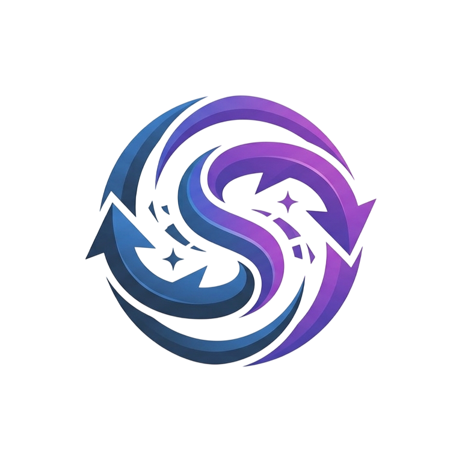

# Ani-sync

<p align="center">
  
</p>

An Obsidian plugin that syncs your [AniList](https://anilist.co/) anime & manga lists into your vault as wikilinked markdown notes, so they show up in Obsidian's graph view. Includes an AI-powered chat assistant to query your library using natural language.

## Features

- **One-click AniList OAuth** via a small GitHub Pages callback page.
- **Incremental, idempotent syncs** — SHA-256-based change detection means a steady-state sync takes ~3 GraphQL calls and 0 writes in under a second.
- **Manual + periodic triggers** — ribbon icon, command palette (with hotkeys), settings button, or a configurable auto-sync interval.
- **Drift-free** — entries you remove from AniList are also removed from your vault.
- **Read-only with respect to AniList** — your AniList list is the source of truth.
- **Works on mobile** — `isDesktopOnly: false`.
- **AI Chat Assistant** — Ask questions about your anime/manga library using natural language, powered by OpenRouter LLMs.
- **Live Typewriter Animation** — Responses stream character-by-character with a blinking cursor, just like ChatGPT.
- **Multi-layer Search Engine** — 6 indexing layers (HeadingIndex, BM25, Trigram, FTS, LinkGraph, MetadataIndex) for fast, accurate results.
- **Smart Character/VA Search** — HeadingIndex provides O(1) lookups for `## CharacterName` across all files.
- **Searchable Model Selector** — Type to filter OpenRouter models in Settings.
- **Graph Colors** — Customize node colors for each note type in Obsidian's Graph View via `.obsidian/graph.json`.
- **Characters & Voice Actors** — Characters synced per-anime with inlined VA data (photo, name, language) and wikilink tags.

## What gets synced

| Note type | Folder | Notes per user |
|-----------|--------|---------------|
| Anime | `Ani-sync/Anime/` | One per anime on the list |
| Manga | `Ani-sync/Manga/` | One per manga on the list |
| Characters | `Ani-sync/Characters/` | One per character, with voice actor data inlined |
| Studios | `Ani-sync/Studios/` | Referenced by Anime notes |
| Staff | `Ani-sync/Staff/` | Referenced by Anime notes (with images) |
| Tags / Genres | `Ani-sync/Tags/` | Referenced by Anime & Manga notes |
| Profile | `Ani-sync/Profile.md` | One summary note |

Every Anime/Manga note links out to studios, staff, characters, tags, and relations with `[[Wiki Links]]`, so they all show up as connected nodes in Obsidian's graph view.

## Requirements

- Obsidian 1.4.0 or later
- An [AniList](https://anilist.co/) account
- A GitHub Pages site hosting this plugin's OAuth callback page (see `docs/`)

## Installation (manual)

1. Download `Ani-sync.zip` from the [latest release](https://github.com/agniveshtm/Ani-sync/releases/latest).
2. Extract the zip — you'll get an `Ani-sync/` folder containing `main.js`, `manifest.json`, and `styles.css`.
3. Copy the `Ani-sync/` folder into `<your-vault>/.obsidian/plugins/`.
4. In Obsidian: **Settings → Community plugins → Installed plugins**, enable **Ani-sync**.

## Installation (developer mode)

1. `npm install` to fetch dev dependencies.
2. `npm run build` to produce `main.js`.
3. Copy `main.js`, `manifest.json`, and `styles.css` from this folder into `<your-vault>/.obsidian/plugins/ani-sync/`.
4. In Obsidian: **Settings → Community plugins → Installed plugins**, enable **Ani-sync**.

## AniList setup (one-time)

1. Host the `docs/` folder of this repo on GitHub Pages.
2. In Obsidian: open **Settings → Ani-sync**:
   - Type your AniList username.
   - Click **Connect to AniList** → a browser tab opens → approve on AniList → AniList registers the **Ani-sync** app under your account → tab auto-closes → status turns to **Connected**.

## Configuration

| Setting | Default | Notes |
|---------|---------|-------|
| AniList username | _(empty)_ | Auto-detected after OAuth |
| Output folder | `Ani-sync` | Created automatically with subfolders |
| Enable auto-sync | `true` | Runs while Obsidian is open |
| Poll interval | `30` (seconds, min 30) | Used when auto-sync is enabled |
| OpenRouter API key | _(empty)_ | Required for AI chat feature |
| OpenRouter model | _(empty)_ | Select from fetched models list |
| Graph Colors | 6 defaults | Per-type colors for Obsidian Graph View |

## Usage

- **Ribbon icons**:
  - (database) — sync now.
  - (message-circle) — open AI chat sidebar.
- **Command palette** (all with hotkeys):
  - `Ani-sync: Sync now` — `Ctrl+Shift+S`
  - `Ani-sync: Disconnect AniList` — `Ctrl+Shift+D`
  - `Ani-sync: Clear sync cache` — `Ctrl+Shift+C`
  - `Ani-sync: Open Ani-sync Chat` — `Ctrl+Shift+O`
- **Settings tab**:
  - **Sync now** / **Clear sync cache** buttons.
  - **OpenRouter AI** section — configure API key and model.
  - **Graph Colors** section — color pickers for each node type.

A toast notice reports `created N, updated M, skipped K, failed F` after each sync.

## How sync works

1. **Summary query** — fetches `id + updatedAt` for every entry (2 GraphQL calls, ANIME and MANGA in parallel).
2. **Diff against cache** — if nothing changed, exit in ~1 s with 0 detail fetches and 0 writes.
3. **Full lists + detail batch** — only changed entries' full Media details are fetched (AniList's `Page(perPage: 50)` query).
4. **Character fetch** — per-media, 4 concurrent, paginated (50 per page). Voice actors filtered to Japanese by preference with fallback.
5. **Build notes** — `builder.ts` formats each entity with wikilinked frontmatter + body (characters get inline VA data + tags).
6. **SHA-256 hash check** — only notes whose hash changed are written; stale file paths are cleaned up on rename.
7. **Removals** — entries removed from AniList are deleted from the vault.

The cache lives in `data.json` (Obsidian's plugin data file). AniList rate limits are respected (700ms minimum between requests, 3-attempt retry on 429 / 5xx with exponential backoff). Character fetch is rate-limited at 4 concurrent requests.

## AI Chat

The plugin includes an AI-powered chat sidebar that lets you query your synced AniList library using natural language.

### Setup

1. Get an API key from [OpenRouter](https://openrouter.ai/).
2. Open **Settings → Ani-sync → OpenRouter AI**.
3. Enter your API key and click **Fetch models**.
4. Select a model from the dropdown (free models are tagged).

### Search Engine

The chat uses a **6-layer search pipeline** that cascades until results are found:

| Layer | Algorithm | Purpose |
|-------|-----------|---------|
| HeadingIndex | `##` heading HashMap (O(1)) | Instant character/VA name lookup — matches any word in query |
| BM25 ranking | TF-IDF with field weighting | Statistical relevance ranking (title weighted 3x body) |
| Trigram Jaccard | 3-char subsequence overlap | Typo-tolerant fuzzy matching ("atack" → "Attack") |
| FTS (Full Text Search) | Tokenization + substring match | Direct title/frontmatter matching |
| LinkGraph | Wikilink traversal | Follows `[[links]]` to related files from matched results |
| Multi-term fallback | Word intersection across all nodes | Relationship queries ("Ichigo and Inoue's kid") |

The heading index extracts all `##` headings from every file during build, providing O(1) lookups. Any word in the user's query can trigger a direct heading match — no fragile regex stripping needed.

The search index is built in-memory on chat open (~200ms for 2000+ entries). Full `.md` body content is included in the prompt context.

### Response Pipeline

```
User query → Quick response? → Static reply (greetings/bye/help)
            → No → Preflight check (API key + model)
                 → Vault index search
                 → Build structured context (frontmatter + full body)
                 → sendChatStream(OpenRouter)
                 → Typewriter animation (flatten+render)
                 → Final render (no cursor)
```

### Features

- **Natural language queries** — "What anime have I rated 10?" or "Show me all anime by MAPPA"
- **Full markdown rendering** — Bold, italic, code blocks, tables, lists, blockquotes
- **Live streaming** — Character-by-character typewriter with blinking cursor, batched for performance
- **Typo-tolerant** — Trigram matching catches misspellings
- **Relationship-aware** — Multi-term fallback finds nodes matching all query tokens
- **Vault-grounded** — Answers come from your data, not LLM training. Full body text included in context
- **Error handling** — Per-error messages for DNS failure, auth errors, rate limits, timeouts

### Example queries

- "What's my highest rated anime?"
- "Show me all anime I've completed"
- "What genres do I watch most?"
- "List all anime by studio Ufotable"
- "What's the staff for Attack on Titan?"
- "Who voices Naruto?"

## Graph Colors

Customize the color of each note type in Obsidian's Graph View via **Settings → Ani-sync → Graph Colors**.

| Type | Default Color |
|------|--------------|
| Anime | `#02a9ff` (blue) |
| Manga | `#8b5cf6` (purple) |
| Staff | `#4ade80` (green) |
| Studios | `#f59e0b` (amber) |
| Tags | `#f87171` (red) |
| Characters | `#fbbf24` (yellow) |

Colors are injected as CSS targeting `.graph-view .graph-node[data-path*="..."]` and as CSS custom properties `--graph-color-N` for Obsidian's native color system.

## Architecture

```
AniList API
  → SyncEngine (diff + fetch + hash + write, 700ms rate limit, 8 concurrent writes)
    → Vault (.md files with frontmatter + wikilinks + SHA-256 markers)
    → data.json (summary map, detail cache, note hashes, file paths)
      → ChatView onOpen() → preloadVaultContext()
        → VaultContext.load() → SearchIndex.build() (trigrams + BM25)
          → handleSend() → buildContextForQuery()
            → sendChatStream(OpenRouter) → typewriter animation → rendered markdown
```

### Concurrency

- Sync writes: 8 concurrent
- Sync deletes: 4 concurrent
- Character fetches: 4 concurrent
- Search index: built once, reused across queries (concurrency-safe via shared promise)
- Typewriter render: lock-flagged to prevent overlapping renders

## Security

- Your AniList token is stored in Obsidian's `data.json` (not synced to git).
- The hosted callback page is static; the Client ID is hardcoded.
- The plugin's settings tab verifies `event.origin === 'https://agniveshtm.github.io'` before trusting the OAuth `postMessage`.
- Your OpenRouter API key is stored in `data.json` and sent only to OpenRouter's API endpoint.

## Project layout

```
.
├── manifest.json                Obsidian plugin manifest
├── main.js                      Built/bundled output
├── styles.css                   Custom styles (chat, settings, progress, cursor)
├── assets/logo.svg              Plugin logo
├── package.json                 devDeps: obsidian, esbuild, typescript, …
├── esbuild.config.mjs           bundles src/main.ts → main.js
├── tsconfig.json                strict TS
├── src/
│   ├── main.ts                  Plugin class, ribbon, commands, sync orchestration, graph colors
│   ├── settings.ts              AnisyncSettings + DEFAULT_SETTINGS + GraphColors
│   ├── settingsTab.ts           Settings tab UI (6 sections, safe-rendered)
│   ├── types.ts                 AniList GraphQL response types (including Character, VoiceActor)
│   ├── auth/
│   │   ├── constants.ts         OAuth URLs, client ID, origin validation
│   │   └── implicit.ts          OAuth implicit flow via postMessage
│   ├── anilist/
│   │   ├── client.ts            GraphQL client (rate-limiter, retry, character fetch)
│   │   └── queries.ts           All GraphQL operations (6 queries)
│   ├── notes/
│   │   ├── builder.ts           Note artifact builder (7 types, character+VA inlining)
│   │   └── slugify.ts           Filename sanitization
│   ├── sync/
│   │   ├── engine.ts            Sync orchestrator (diff → fetch → build → hash → write/delete)
│   │   ├── hash.ts              SHA-256 via crypto.subtle + marker extract/strip
│   │   └── cache.ts             Cache schema + diff algorithm
│   ├── chat/
│   │   ├── view.ts              Chat UI (typewriter, markdown, quick responses, error handling)
│   │   ├── vaultContext.ts      6-layer search engine (HeadingIndex, BM25, Trigram, LinkGraph, MetadataIndex)
│   │   └── logo.ts              Logo data URL for welcome screen
│   └── openrouter/
│       ├── client.ts            OpenRouter API (models list + streaming chat completions)
│       └── types.ts             OpenRouter API types
├── docs/                        Host on GitHub Pages for OAuth callback
│   ├── index.html               Callback page with postMessage
│   ├── style.css
│   └── script.js
└── .github/workflows/
    ├── test.yml                 CI: typecheck + build
    ├── deploy-docs.yml          Deploy docs/ to GitHub Pages
    └── release.yml              Build + create release with zip
```

## See also

- `solution.md` — Technical notes and improvement log.

## License

MIT
